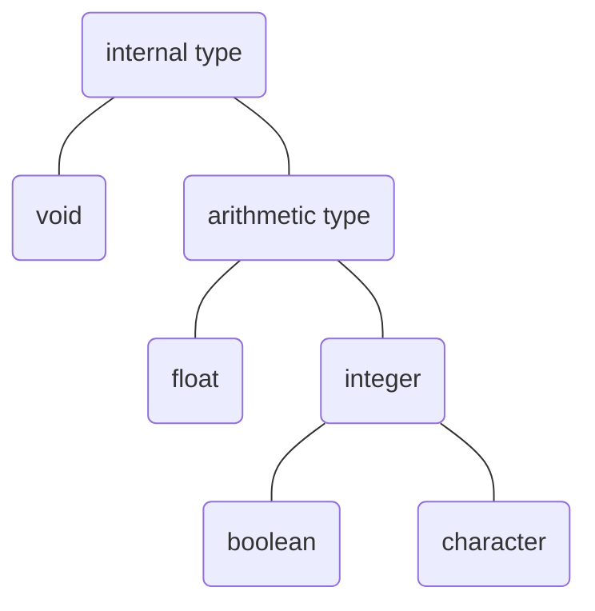
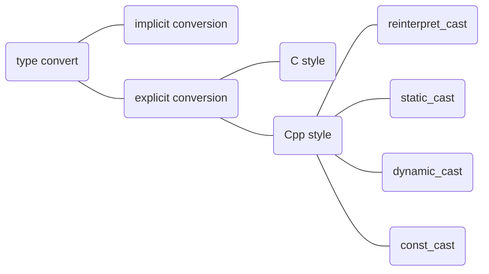

# Variables and basic types

## Basic internal type

The basic internal type can be categorized by the structure as below. It is useful to highlight that ***float*** number are arranged in a very different way compare with ***integer*** number. In one hand, these two type of number are differently **stored** in memory. In another hand, these two type of number are calculated with different **hardware**.



### Arithmetic type

When we dig into the specific types, first thing to know is their general function and size, which is shown in the chart below.

|   type    |    meaning    |  minimum size |
|:----------|:--------------|:--------------|
|bool       |boolean        |undefined      |
|char       |character      |8bits          |
|wchar_t    |wide char      |16bits         |
|char16_t   |Unicode char   |16bits         |
|char32_t   |Unicode char   |32bits         |
|short      |short integer  |16bits         |
|int        |integer        |16bits         |
|long       |long integer   |32bits         |
|long long  |long integer   |64bits         |
|float      |single precision|16bits        |
|double     |double precision|32bits        |
|long double|external precision|64bits      |

By the way, all the integer has an unsigned version, which can be create/use with *unsigned* prefix. For example `int` and `unsigned int`.

### Type convert

There are many different way of conversion. In general, there are implicit conversion and explicit conversion. In the explicit conversion there are classic C way and a set of modern C++ ways. All the conversions can be arranged as the graph below.



There is a specific rule for each conversion from one type to another. As you can see, every the object, whether it is internal or user defined, is a specific combination of internal type, which means the default conversion is rooted in the principle of C++. Thus, it is genius to focus on the basic principles of conversions.

1. From others to boolean: **zero** converted to *false*, **non-zero** converted to *true*.
2. From boolean to others: **false** converted to *0*, **true** converted to *1*.
3. From floating point number(`float`,`double`,etc) to integer: Only reserve the **integer part**.
4. From integer to floating point number: Assigned the fraction part to *zero*, **ignore** the part can't be store.
5. Assigned an out_of_range value to an unsigned integer: `result = (value)%(size_of(result))`
6. Assigned an out_of_range value to a signed integer: undefined action. (the result is largely depend on the compiler you use)

> **More explanation for <4.>:** In fact, the description of "ignore" is no that precise at all. As you know, the floating point number takes the form as below: 3.1415926e0. So, there is actually no such concept as fraction, or in another word, all the numbers except for the exponent are fraction. Extended reading: [IEEE Floating Point Standard](https://ieeexplore.ieee.org/document/4610935).
> **More explanation for <5.>:** For the negative number which is legal for the same signed type, the value assigned to unsigned is the raw value of signed number. In visual studio, if the number can be represent in the same bits, the raw value will be assigned, otherwise *0* will be assigned representing the existence of a potential bug.

### Literal

The numbers, characters, strings that we write in the code are literals. In order to correspond with one of the cpp's major principle - "type check", each of these literals is born with a type though it is not an ordinate variables.
> It's true that these literals are just **pure numbers**, however, the same judgement can be made when facing all other variables. The idea above is rather **genius** in *C* language, in fact, this idea show a depth understanding of computer. However, as a *Cpp* programmer we have to keep the idea of "type" in mind and use the **type check** as an useful tool to write swift but rather **maintanable** codes.

For 'pure number'

```c++
// Integer
    20      // DEC (decimal)
    020     // OCT (octonary) '0' prefix
    0x20    // HEX (hexadecimal) '0x' prefix
    20U     // unsigned, 'u' or 'U' suffix -> unsigned
    20L     // long, 'l' or 'L' suffix -> long
    20LL    // long long, 'll' or 'LL' suffix -> long long
// Floating point
    3.14    // double, floating point number are double by default
    3.14e0  // double
    0.      // double
    0e0     // double
    .001    // double
    3.14f   // float, 'f' or 'F' suffix -> float
    0f      // float
    3.14L   // long double, 'l' or 'L' suffix -> long double
```

For 'characters'

## Variable

### Definition & initialize

General form of defining a variable is `type_specifier name_of_variable1, name_of_variable2, ...;`, where every definition starts with a *type specifier* then follow a list of variables name which are seperated by *comma*. Last, the definition ends with *semicolon*.

If the variable is assigned to a value as soon as it is defined, we say this variable is **initialized**. In the most simple way, this initialization looks like `int i = 0;`. Looked alike to assigning value though it is, **initialization** is totally different from **assignment** in *Cpp*. That's because each operation in *Cpp* is bonded to a corresponding function, in this case specifically, is the **constructor function** and the **assignment operator function**. So when you write the code `int i = 0`, it actually performs like `int i(0); // call: int::int(const int&) constructor`. By the way, `i = 0` performs like `i.operator=(0); // call: int& int::operator=(int&&)`.

#### List initialization

There are two types of list initialization: Direct-list-initialization and Copy-list-initialization.

Syntax:

```c++
// Direct-list-initialization
    T object { arg1, arg2, ...}                     // (1)
    T { arg1, arg2, ... }                           // (2)
    new T { arg1, arg2, ... }                       // (3)
    Class { T member { arg1, arg2, ... }; };        // (4)
    Class::Class() : member{arg1, arg2, ...} {...}  // (5)
// Copy-list-initialization
    T object = {arg1, arg2, ...};                   // (6)
    function( { arg1, arg2, ... } )                 // (7)
    return { arg1, arg2, ... } ;                    // (8)
    object[ { arg1, arg2, ... } ]                   // (9)
    object = { arg1, arg2, ... }                    // (10)
    U( { arg1, arg2, ... } )                        // (11)
    Class { T member = { arg1, arg2, ... }; };      // (12)
```

direct-list-initialization (both explicit and non-explicit constructors are considered)
>(1) initialization of a named variable with a *braced-init-list* (that is, a possibly empty brace-enclosed list of expressions or nested braced-init-lists)
>(2) initialization of an unnamed temporary with a *braced-init-list*
>(3) initialization of an object with dynamic storage duration with a new-expression, where the initializer is a *braced-init-list*
>(4) in a non-static data member initializer that does not use the equals sign
>(5) in a member initializer list of a constructor if *braced-init-list* is used

---

copy-list-initialization (both explicit and non-explicit constructors are considered, but only non-explicit constructors may be called)
>(6) initialization of a named variable with a *braced-init-list* after an equals sign
>(7) in a function call expression, with *braced-init-list* used as an argument and list-initialization initializes the function parameter
>(8) in a return statement with *braced-init-list* used as the return expression and list-initialization initializes the returned object
>(9) in a subscript expression with a user-defined operator[], where list-initialization initializes the parameter of the overloaded operator
>(10) in an assignment expression, where list-initialization initializes the parameter of the overloaded operator
>(11) functional cast expression or other constructor invocations, where *braced-init-list* is used in place of a constructor argument. Copy-list-initialization initializes the constructor's parameter (note; the type U in this example is not the type that's being list-initialized; U's constructor's parameter is)
>(12) in a non-static data member initializer that uses the equals sign

Notes:

1. **braced-init-list**: structure like this `{arg1, arg2, ...}`

### Compound type

## references

"IEEE Standard for Floating-Point Arithmetic," in IEEE Std 754-2008 , vol., no., pp.1-70, 29 Aug. 2008, doi: 10.1109/IEEESTD.2008.4610935.
[list_initialization from cppreference.com](https://en.cppreference.com/w/cpp/language/list_initialization)
