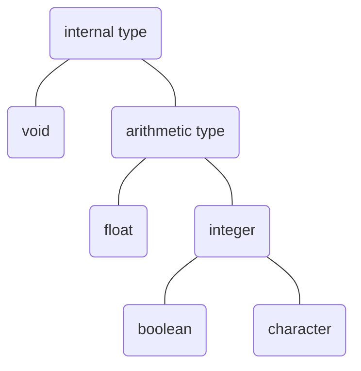
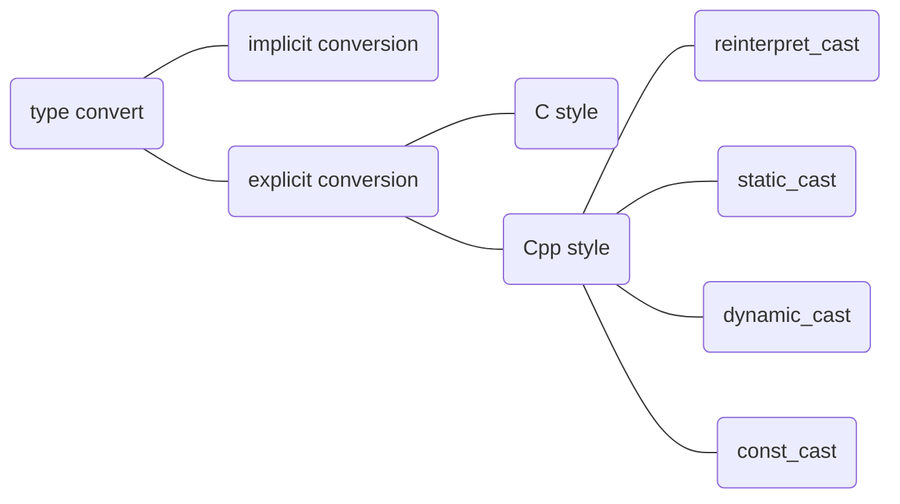

# Variables and basic types

## Basic internal type

The basic internal type can be categorized by the structure as below. It is useful to highlight that ***float*** number are arranged in a very different way compare with ***integer*** number. In one hand, these two type of number are differently **stored** in memory. In another hand, these two type of number are calculated with different **hardware**.

### Arithmetic type

When we dig into the specific types, first thing to know is their general function and size, which is shown in the chart below.
|   type    |    meaning    |  minimum size |
|:----------|:--------------|:--------------|
|bool       |boolean        |undefined      |
|char       |character      |8bits          |
|wchar_t    |wide char      |16bits         |
|char16_t   |Unicode char   |16bits         |
|char32_t   |Unicode char   |32bits         |
|short      |short integer  |16bits         |
|int        |integer        |16bits         |
|long       |long integer   |32bits         |
|long long  |long integer   |64bits         |
|float      |single precision|16bits        |
|double     |double precision|32bits        |
|long double|external precision|64bits      |
By the way, all the integer has an unsigned version, which can be create/use with *unsigned* prefix. For example `int` and `unsigned int`.

### Type convert

There are many different way of conversion. In general, there are implicit conversion and explicit conversion. In the explicit conversion there are classic C way and a set of modern C++ ways. All the conversions can be arranged as the graph below.

There is a specific rule for each conversion from one type to another. As you can see, every the object, whether it is internal or user defined, is a specific combination of internal type, which means the default conversion is rooted in the principle of C++. Thus, it is genius to focus on the basic principles of conversions.

1. From others to boolean: **zero** converted to *false*, **non-zero** converted to *true*.
2. From boolean to others: **false** converted to *0*, **true** converted to *1*.
3. From floating point number(`float`,`double`,etc) to integer: Only reserve the **integer part**.
4. From integer to floating point number: Assigned the fraction part to *zero*, **ignore** the part can't be store.
5. Assigned an out_of_range value to an unsigned integer: `result = (value)%(size_of(result))`
6. Assigned an out_of_range value to a signed integer: undefined action. (the result is largely depend on the compiler you use)

> **More explanation for <4.>:** In fact, the description of "ignore" is no that precise at all. As you know, the floating point number takes the form as below: 3.1415926e0. So, there is actually no such concept as fraction, or in another word, all the numbers except for the exponent are fraction. Extended reading: [IEEE Floating Point Standard](https://ieeexplore.ieee.org/document/4610935).
> **More explanation for <5.>:** For the negative number in range(legal value for signed type), the value assigned to unsigned is the raw value of signed number. In visual studio, if the number can be represent in the same size the raw value will be assigned otherwise *0* will be assigned noting a possible bug exists.

### Literal

The numbers, characters, strings that we write in the code are literals. In order to correspond with one of the cpp's major principle - "type check", each of these literals is born with a type though it is not an ordinate variables.
> It's true that these literals are just **pure numbers**, however, the same judgement can be made when facing all other variables. The idea above is rather **genius** in *C* language, in fact, this idea show a depth understanding of computer. However, as a Cpp programmer we have to keep the idea of "type" in mind and use the **type check** as an useful tool to write swift but rather **maintanable** codes.

## Variable

### Compound type
