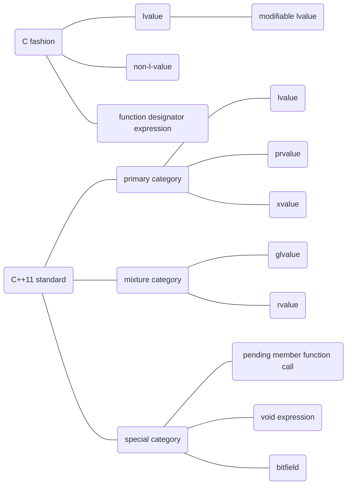

# Value category: development and use case

## Introduction

One of the most fundamental elements for every function is its value. Generalizely speaking, the *term* **value** a much wider concept than concept of variable, that every *expression* have a **value** and each line of C/C++ code is consisted of various of *expression*. The attributes of value are so complex that among different circumstances we can have vary diverse way to category them. In C family, however, there is a long lasting way that separates the value into *lvalue* and *non-lvalue*. Inherited from *C* originally though it was, in *Cpp*, this way of category was extended in *C++11* and become the great fundation of a large amount of new feature in this standard.

## References

[C_value_category](https://en.cppreference.com/w/c/language/value_category)
[Bjarne Stroustrup]“New” Value Terminology.
